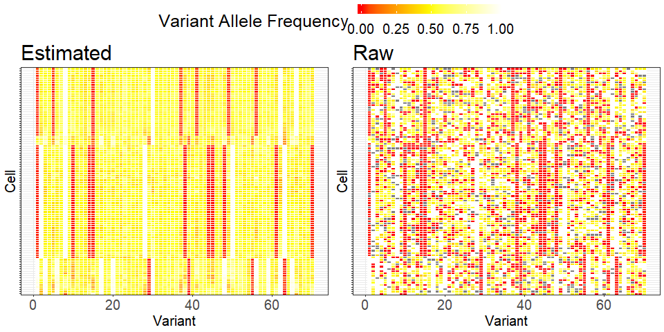

<!-- README.md is generated from README.Rmd. Please edit .Rmd file -->


Please visit our website for more bioinformatics tools: https://qbrc.swmed.edu/labs/wanglab

```{r, echo = FALSE}
knitr::opts_chunk$set(
  collapse = TRUE,
  comment = "#>",
  fig.path = "README-",
  error = TRUE
)
```

# SClineager

This is a README file of the R package _SClineager_. In our paper [available in bioRxiv](https://www.biorxiv.org/content/10.1101/2020.01.01.892562v1), we develop a Bayesian hierarchical  model that performs lineage tracing of single cells based on genetic markers. Single cell variant calling has two inherent issues: (1) low coverage on many positions in many cells and (2) allelic bias due to true monoallelic expression in single cells or due to sampling bias. This algorithm infers genetic trajectories of cells by taking these two issues into account. More details about the structure of the data can be found in the example dataset that goes along with this R package. The details of the Bayesian model can be found in our upcoming paper. Detailed usage instructions can be found in the function manual. Here we provide a basic workflow.


## Configuration

- For this exposition, _Rcpp_ ver 1.0.2, _MCMCpack_ ver 1.4.5, _vioplot_ ver 0.3.4, _gplots_ ver 3.0.3 are used.

- _SClineager_ ver 1.10 is performed in R ver 3.6.2 interfaced with a MacBook Pro with a 3.0 GHz Dual Core Intel Core i7 and 16 GB RAM.


## Installation of the package

To install our package, you may simply execute the following codes. The installation will take about a minute.

```{r, eval = FALSE}
# install.packages("devtools")
devtools::install_github("inmybrain/SClineager", subdir = "SClineager") # don't forget to specify subdir!
```

If you come across a problem like [this](https://github.com/r-lib/remotes/issues/130), please refer to [this answer](https://github.com/r-lib/remotes/issues/130#issuecomment-423830669) in that issue.


<!-- Or you can install the source file using the command line after downloading it from [here](XXX) (NOT AVAILABLE NOW); -->
<!-- ```{bash, eval = FALSE} -->
<!-- R CMD INSTALL BayesianMIR_1.0.tar.gz -->
<!-- ``` -->

### Dependencies

- To install _SClineager_, you will need the following R packages (and their dependencies): _Rcpp_ (>= 1.0.2), _MCMCpack_, _vioplot_, _gplots_. This information is specified in DESCRIPTION file in ''SClineager'' folder 

- No specific operating system is required.


<!-- ## Download the example dataset -->
<!-- The dataset used in the following illustration of _SClineager_ can be downloaded in [here](?). -->

## A basic example of using the package
The names of folders in this example can be anything. Just change the codes to read from the correct directories. The names and formats of the .txt files have to be the same. First, your working directory should be at _test_ that contains two sub-folders _mutations_ and _processed_. Please see the following directory structure used in our example. The _mutations_ folder contains the mutation data of different cells (such as P301_9_5) of different samples (such as 301). The _processed_ folder will need to contain empty sub-folders corresponding to the sample names.

```bash
── test
    ├── mutations
    │   ├── 301
    │   │   ├── P301_9_5
    │   │   │   ├── coverage.txt
    │   │   │   └── germline_mutations_hg38.txt
    │   │   ├── P301_9_72
    │   │   │   ├── coverage.txt
    │   │   │   └── germline_mutations_hg38.txt
    │   │   └── P301_9_82
    │   │       ├── coverage.txt
    │   │       └── germline_mutations_hg38.txt
    │   └── 304
    │       ├── P304_8_188
    │       │   ├── coverage.txt
    │       │   └── germline_mutations_hg38.txt
    │       ├── P304_9_40
    │       │   ├── coverage.txt
    │       │   └── germline_mutations_hg38.txt
    │       └── P304_9_63
    │           ├── coverage.txt
    │           └── germline_mutations_hg38.txt
    └── processed
        ├── 301
        └── 304
```


### Read data

We read each mutation information using `read_sclineager`, which takes about 30 seconds.

```{r, eval = FALSE}
coverage_cutoff <- 3
coverage_percentage <- 0.2
cell_percentage <- 0.2
artefact_percentage <- 0.03

for (folder in c(301, 304)){
  print(folder)
  runinfo <- data.frame(
    Cell = list.files(paste("./mutations/", folder, sep = "")),
    Path = list.files(paste("./mutations/", folder, sep = ""), full = T),
    stringsAsFactors = F
  )
  out_folder <- paste("./processed/", folder, sep = "")
  preprocess_genetics <- read_sclineager(runinfo,
                                        coverage_cutoff,
                                        coverage_percentage,
                                        cell_percentage,
                                        out_folder,
                                        artefact_percentage)
}
```

After running the above code, we get for each mutation a RData file that will be used in the SClineager model and a pdf file that visualizes data information. `cleaned.RData` contains an R object named `results`, which has the following information:

- `mutations_mat` : raw matrix of variants and VAFs 
- `runinfo` : same as the `runinfo` parameter in the input, but contains only cells found in `mutations_mat` in the same order
- `annotation` : annotation information of the variants in `mutations_mat`
- `coverage_mat` : coverage data of the same cells and same variants as in `mutations_mat`


```bash
── processed
    ├── 301
    │   ├── cleaned.RData
    │   └── summary.pdf
    └── 304
        ├── cleaned.RData
        └── summary.pdf
```

### Exploratory analysis

Basic data visualization is performed through `explore_sclineager`, which takes less than a second.
```{r, eval = FALSE}
folders <- list.files("./processed", full.names = T)
explore_sclineager(folders, coverage_cutoff, "./mCelSeq2_exploratory.pdf")
```


### Run SClineager

The main function `run_sclineager` performs the MCMC sampling and returns estimation results. The analysis has to be performed for each sample independently. 
The whole procedures take less than a few seconds. 
The results will be saved as `results.RData` in `file_out`, which contains an R object named `results` with the following attributes:

- `genotype_mat` : inferred VAF matrix
- `genotype_mat_orig` : the raw VAF matrix
- `sigma` : inferred covariance matrix
- `genotype_mat_all` and `sigma_all`: sampled parameters at each iteration
- `runinfo`, `annotation` : same as above 

```{r, eval = FALSE}
for (folder in c(301, 304)){
  print(folder)

  file_out <- paste("./processed/", folder, sep = "") # a folder to hold temporary results
  categories <- c("chrM",
                 "synonymous SNV",
                 "nonsynonymous SNV",
                 "UTR5",
                 "UTR3",
                 "nonframeshift substitution",
                 "frameshift substitution")
  max_iter <- 100
  file_in0 <- paste("./processed/", folder, "/cleaned.RData", sep = "")
  mask_genes <- c("HLA-A", "HLA-B", "HLA-C")
  vaf_offset <- 0.01
  dfreedom <- 100
  skip_common <- T
  control <- list(a = 0.5,
                 b = 0.5,
                 c = 1,
                 d = 20,
                 e = 0.4)
  
  sclineager_results <- run_sclineager(
    file_in = file_in0,
    folder = file_out,
    categories = categories,
    max_iter = max_iter,
    keep_genes = "all",
    mask_genes = mask_genes,
    vaf_offset = vaf_offset,
    dfreedom = dfreedom,
    skip_common = skip_common,
    psi = NULL,
    control = control,
    save = FALSE
  )
}
```

As a result, `results.RData` and `imputation_results.pdf` are generated under each mutation folder.
```bash
── processed
    ├── 301
    │   ├── cleaned.RData
    │   ├── imputation_results.pdf
    │   ├── results.RData
    │   └── summary.pdf
    └── 304
        ├── cleaned.RData
        ├── imputation_results.pdf
        ├── results.RData
        └── summary.pdf
```

<!-- ### Visualization -->
<!-- Using the fitted model, a scatter plot for multiple instance regression can be provided as follows. -->
<!-- ```{r, eval = TRUE} -->
<!-- MIScatterPlot(tidydata = tidydata,  -->
<!--               bag_size = 5, -->
<!--               true_primary = lapply(1:tidydata$nsample, function(x) rep(c(T,F), c(1, ninst - 1))),  -->
<!--               pred_primary = lapply(split(BMIR_fit$pip[,1], tidydata$membership), function(x) rank(-x, ties.method = "min") <= 1) -->
<!-- ) -->
<!-- ``` -->

<!-- Using slightl modified `ggmcmc::ggs_density` function, we can have the Bayesian inference. -->
<!-- ```{r, eval = TRUE} -->
<!-- # install.packages("ggmcmc") -->
<!-- library("ggmcmc") -->
<!-- ggs_density <- function (D, ncol, family = NA, rug = FALSE, hpd = FALSE, greek = FALSE)  -->
<!--   ## - ncol is added! -->
<!--   ## - ci -> ggmcmc::ci -->
<!--   ## - [Low, High] interval is commented -->
<!-- { -->
<!--   if (!is.na(family)) { -->
<!--     D <- get_family(D, family = family) -->
<!--   } -->
<!--   if (attributes(D)$nChains <= 1) { -->
<!--     f <- ggplot(D, aes(x = value)) -->
<!--   } -->
<!--   else { -->
<!--     f <- ggplot(D, aes(x = value, colour = as.factor(Chain),  -->
<!--                        fill = as.factor(Chain))) -->
<!--   } -->
<!--   f <- f + geom_density(alpha = 0.3) + scale_fill_discrete(name = "Chain") +  -->
<!--     scale_colour_discrete(name = "Chain") -->
<!--   if (!greek) { -->
<!--     f <- f + facet_wrap(~Parameter, ncol = ncol, scales = "free") -->
<!--   } -->
<!--   else { -->
<!--     f <- f + facet_wrap(~Parameter, ncol = ncol, scales = "free",  -->
<!--                         labeller = label_parsed) -->
<!--   } -->
<!--   if (rug)  -->
<!--     f <- f + geom_rug(alpha = 0.1) -->
<!--   if (hpd) { -->
<!--     ciD <- ggmcmc::ci(D) -->
<!--     f <- f + geom_segment(data = ciD, size = 2, color = "blue", inherit.aes = FALSE,  -->
<!--                           aes(x = low, xend = high, y = 0, yend = 0))  -->
<!--     # +geom_segment( -->
<!--     #   data = ciD, -->
<!--     #   size = 1, -->
<!--     #   inherit.aes = FALSE, -->
<!--     #   aes( -->
<!--     #     x = Low, -->
<!--     #     xend = High, -->
<!--     #     y = 0, -->
<!--     #     yend = 0 -->
<!--     #   ) -->
<!--     # ) -->
<!--   } -->
<!--   return(f) -->
<!-- } -->
<!-- ggs_mcmc <- ggmcmc::ggs(BMIR_fit$mcmclist) -->
<!-- ggs_mcmc$Parameter <- factor(ggs_mcmc$Parameter, labels = c(paste0("coef", 1:(nfeature + 1)), "sig2_error")) -->
<!-- ggs_density(ggs_mcmc %>%  -->
<!--               filter(Iteration > ntotal * 1 / 4),  -->
<!--             ncol = 2, -->
<!--             hpd = TRUE) +  -->
<!--   geom_vline(data = data.frame(Parameter = c(paste0("coef", 1:(nfeature + 1)), "sig2_error"), -->
<!--                                true_val = c(rep(2, 1 + nfeature), 1)), -->
<!--              aes(xintercept = true_val), color = "red") + -->
<!--   labs(x = "Value", y = "Density") +  -->
<!--   theme(axis.text.y = element_blank(), -->
<!--         axis.ticks.y = element_blank()) -->
<!-- ``` -->

<!-- ### Prediction in new bags -->
<!-- When new bags (i.e. without labels) are given, we can predict both labels and primary instances using `predict.BMIR`. -->

<!-- ```{r, eval = TRUE} -->
<!-- pred_fit <- predict.BMIR(BMIRchain = BMIR_fit$mcmclist$Chain1,  -->
<!--                          pip = BMIR_fit$pip[,1],  -->
<!--                          tidydata = tidydata,  -->
<!--                          newtidydata = newtidydata,  -->
<!--                          k = 1) -->
<!-- ``` -->

<!-- Let us see how prediction works. -->

<!-- ```{r, eval = TRUE} -->
<!-- ggplot(data = data.frame(pred = pred_fit$newtidydata$label,  -->
<!--                          true = label[-(1:100)]),  -->
<!--        mapping = aes(x = pred, y = true)) +  -->
<!--   geom_point() + geom_abline(intercept = 0, slope = 1, color = "red") -->
<!-- ``` -->

## Another toy example with simulated data

You can reach one of toy datasets used in our simulation study through [this link](https://github.com/inmybrain/SClineager/tree/master/data), which points to the folder `data` of this repository.
We provide this small toy dataset because the runtime will be very short.


The main function of _SClineager_ is `sclineager_internal`, which runs the Bayesian sampling with mutations and coverage inputs. The sampling with this dataset takes about 5-6 seconds.

```{r, eval = FALSE}
load("./data/toy_data.RData")

fit_scl <-
  sclineager_internal(
    mutations_mat = res_data$mutations_mat_obs,
    coverage_mat = res_data$coverage_mat_obs,
    max_iter = 100,
    vaf_offset = 0.01,
    dfreedom = ncol(res_data$mutations_mat_obs),
    psi = diag(1, ncol(res_data$mutations_mat_obs)),
    save = F
  )
```

The following code block is to generate heatmaps for raw and fitted VAFs.
```{r, eval = FALSE}
library("reshape2") # convert a wide matrix to a long matrix
library("lemon") # to make a shared legend

melted_VAF <- melt(t(fit_scl$genotype_mat))
melted_VAF$Var1 <- factor(x = melted_VAF$Var1,
                          levels = (unique(melted_VAF$Var1))[order_VAF],
                          ordered = TRUE)

gg_fig <-
  ggplot(data = melted_VAF %>%
           filter(Var2 != 71)) +
  geom_tile(aes(x = Var2, y = Var1, fill = value), color = "white") +
  scale_fill_gradient2(
    low = "red",
    high = "white",
    mid = "yellow",
    midpoint = 0.5,
    limit = c(0, 1),
    # space = "Lab",
    name = "Variant Allele Frequency"
  ) +
  labs(x = "Variant", y = "Cell") +
  user_theme +
  theme(axis.text.y = element_blank()) +
  theme(# Change legend key size and key width
    legend.key.size = unit(1.5, "cm"),
    legend.key.height = unit(0.5, "cm"))

### raw
melted_VAF_raw <- melt(t(res_data$mutations_mat_obs))
melted_VAF_raw$Var1 <- factor(x = melted_VAF_raw$Var1, 
                              levels = (unique(melted_VAF_raw$Var1))[order_VAF],
                              ordered = TRUE)
```

The results are compared below.
```{r, eval = FALSE}
grid_arrange_shared_legend(gg_fig + ggtitle("Estimated"), 
                           (gg_fig %+% melted_VAF_raw) + ggtitle("Raw"), 
                           nrow = 1, 
                           position = "top")
```


## CTCL dataset

We also provide this CTCL dataset from the Mimitou et al. publication [[1]](#1), which we processed and used in our manuscript.


## References
<a id="1">[1]</a> 
Mimitou, E. P. et al. (2019) Multiplexed detection of proteins, transcriptomes, clonotypes and CRISPR perturbations in single cells. Nat. Methods 16, 409–412.

## Notes

The variant calling of the single cell sequencing data should be performed by our variant calling pipeline: https://github.com/tianshilu/QBRC-Somatic-Pipeline (temporarily closed as of 20.09.24). One should use the "tumor-only" mode for calling mutations, and set "keep_coverage" (keep coverage data) to 1. Also, please change the Perl script somatic.pl so that `$skip_recal=1` (skip base recalibration), and `$lofreq=1` (use lofreq for scATAC-seq) or =0 (use strelka for scRNA-Seq).
Alternatively, the users can formulate their own variant calling results into the format of our pipeline’s results. Please refer to the example datasets incorporated in this R package for our format.


<!-- - For available covariance structures, see the help page; -->
<!-- ```{r, eval = FALSE} -->
<!-- ?Mclust_SEP_cpp -->
<!-- ``` -->

<!-- - As for initial assignment of cluster membership, each sample is assigned randomly to clusters. -->

## Issues

We are happy to troubleshoot any issue with the package;

- please contact to the maintainer by seongohpark6@gmail.com, or

- please open an issue in the github repository.

<!-- ## Error and warning messages you may get -->
 
<!-- ## References  -->

## License
GPL 3.0